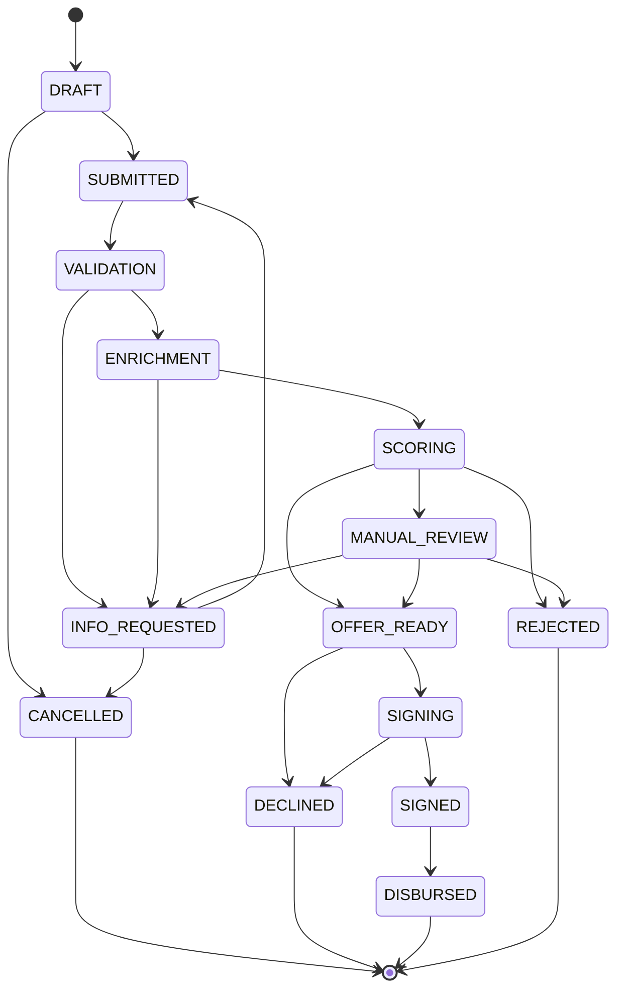

# Диаграмма состояний заявки

Сгенерировано из `app/domain.py::TRANSITIONS` (`python scripts/gen_docs.py`).

```mermaid
stateDiagram-v2
    [*] --> DRAFT
    DRAFT --> CANCELLED
    DRAFT --> SUBMITTED
    SUBMITTED --> VALIDATION
    VALIDATION --> ENRICHMENT
    VALIDATION --> INFO_REQUESTED
    ENRICHMENT --> INFO_REQUESTED
    ENRICHMENT --> SCORING
    SCORING --> MANUAL_REVIEW
    SCORING --> OFFER_READY
    SCORING --> REJECTED
    MANUAL_REVIEW --> INFO_REQUESTED
    MANUAL_REVIEW --> OFFER_READY
    MANUAL_REVIEW --> REJECTED
    INFO_REQUESTED --> CANCELLED
    INFO_REQUESTED --> SUBMITTED
    OFFER_READY --> DECLINED
    OFFER_READY --> SIGNING
    SIGNING --> DECLINED
    SIGNING --> SIGNED
    SIGNED --> DISBURSED
    CANCELLED --> [*]
    DECLINED --> [*]
    DISBURSED --> [*]
    REJECTED --> [*]
```
